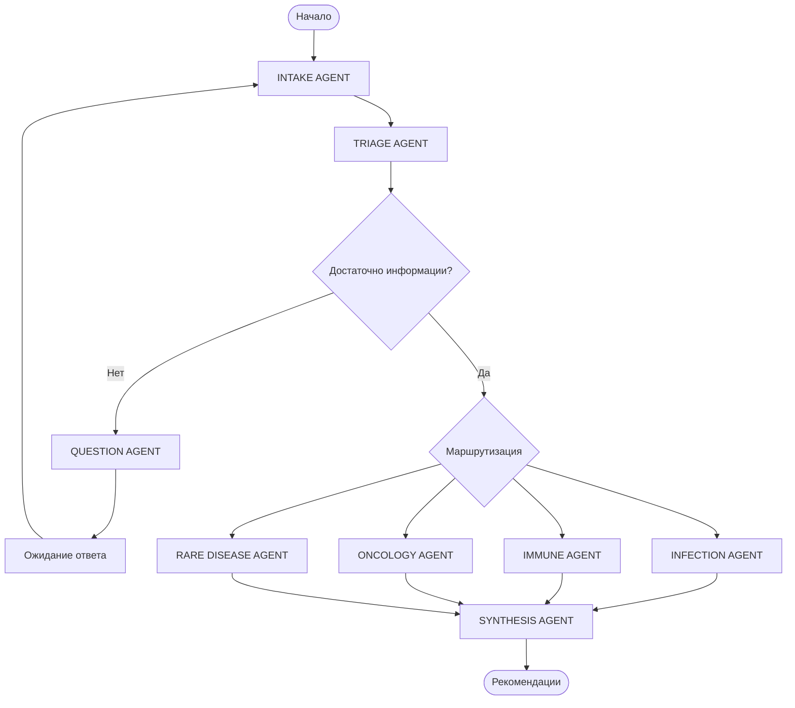

# Мультиагентная система маршрутизации детей с лихорадкой

## 📋 Описание проекта

Интеллектуальная система на базе LangGraph для помощи врачам в диагностике и маршрутизации детей с лихорадкой к профильным специалистам и благотворительным фондам.

## 🎯 Ключевые возможности

- ✅ **Структурированный сбор данных** о пациенте через диалог
- ✅ **Контекстная память** - система помнит всю историю диалога
- ✅ **8 специализированных агентов** для комплексного анализа
- ✅ **Дифференциальная диагностика** по 4 направлениям
- ✅ **Рекомендации по маршрутизации** к узким специалистам
- ✅ **Экспорт результатов** в PDF
- ✅ **Мониторинг и логирование** работы системы

## 🏗️ Архитектура

### Компоненты системы

```
┌─────────────────────────────────────────────────────────┐
│                    Web Interface                         │
│                   (React + TypeScript)                   │
└────────────────────────┬────────────────────────────────┘
                         │
                         ▼
┌─────────────────────────────────────────────────────────┐
│                    FastAPI Backend                       │
│              + LangGraph Orchestrator                    │
└────────────────────────┬────────────────────────────────┘
                         │
                         ▼
┌─────────────────────────────────────────────────────────┐
│              Yandex AI Studio (8 агентов)               │
│                  Qwen3-235B модель                       │
└─────────────────────────────────────────────────────────┘
```

### Граф агентов



## 📁 Структура проекта

```
fever-routing-system/
├── backend/                    # FastAPI приложение
│   ├── app/
│   │   ├── api/               # API endpoints
│   │   ├── core/              # LangGraph + AI Studio
│   │   ├── db/                # База данных
│   │   ├── services/          # Бизнес-логика
│   │   └── utils/             # Утилиты
│   ├── tests/                 # Тесты
│   ├── requirements.txt
│   └── Dockerfile
│
├── frontend/                   # React приложение
│   ├── src/
│   │   ├── components/        # React компоненты
│   │   ├── services/          # API клиенты
│   │   ├── hooks/             # Custom hooks
│   │   └── store/             # Redux store
│   ├── package.json
│   └── Dockerfile
│
├── monitoring/                 # Prometheus + Grafana
│   ├── prometheus.yml
│   └── grafana/
│
├── docs/                       # Документация
│   ├── architecture_plan.md
│   ├── architecture_plan_part2.md
│   └── architecture_plan_part3.md
│
├── docker-compose.yml
├── .env.example
├── deploy.sh
└── README.md
```

## 🚀 Быстрый старт

### Предварительные требования

- Docker 24.0+
- Docker Compose 2.20+
- Yandex Cloud аккаунт с доступом к AI Studio

### 🔑 Получение ключей Yandex Cloud

**Обязательно прочитайте [YANDEX_CLOUD_SETUP.md](./YANDEX_CLOUD_SETUP.md)**

Для работы системы нужны:

1. **Yandex Cloud Folder ID** - ID вашего каталога
2. **IAM Token** - Токен доступа (срок действия 12 часов)
3. **Доступ к AI Studio агентам** - Роли `ai.languageModels.user` и `ai.agent.user`

**Быстрая настройка:**
```bash
# 1. Установите Yandex CLI
curl -sSL https://storage.yandexcloud.net/yandexcloud-yc/install.sh | bash
exec bash

# 2. Авторизуйтесь
yc init

# 3. Получите Folder ID и IAM Token
yc resource-manager folder list
yc iam create-token
```

### Установка

1. **Клонирование репозитория**
```bash
git clone <repository-url>
cd fever-routing-system
```

2. **Настройка окружения**
```bash
cp .env.example .env
nano .env  # Заполните необходимые переменные
```

Обязательные переменные:
- `YANDEX_CLOUD_FOLDER_ID` - ID каталога в Yandex Cloud
- `YANDEX_CLOUD_IAM_TOKEN` - IAM токен доступа
- `POSTGRES_PASSWORD` - Пароль для PostgreSQL
- `SECRET_KEY` - Секретный ключ приложения

3. **Запуск системы**

   **Через Docker (Colima на macOS):**
   ```bash
   # В одном терминале запустите Colima (один раз, дождитесь "colima is running"):
   colima start

   # В другом терминале поднимите сервисы:
   ./scripts/run-local-colima.sh
   # или вручную:
   export FRONTEND_API_URL=http://localhost:8000
   docker-compose up -d
   ```

   Или через deploy.sh:
   ```bash
   chmod +x deploy.sh
   ./deploy.sh
   ```

4. **Проверка работоспособности**
```bash
# Проверка статуса
docker-compose ps

# Проверка логов
docker-compose logs -f backend

# Проверка API
curl http://localhost:8000/health
```

### Доступ к сервисам

- **Frontend**: http://localhost:3000
- **Backend API**: http://localhost:8000
- **API Documentation**: http://localhost:8000/docs
- **Prometheus**: http://localhost:9090
- **Grafana**: http://localhost:3001 (admin/admin)

## 📚 Документация

### Настройка и развертывание

1. **[YANDEX_CLOUD_SETUP.md](./YANDEX_CLOUD_SETUP.md)** - 🔑 Подробная инструкция по получению ключей Yandex Cloud
2. **[QUICK_START.md](./QUICK_START.md)** - 🚀 Быстрый старт за 5 минут
3. **[DEVELOPMENT.md](./DEVELOPMENT.md)** - 🛠️ Руководство для разработчиков
4. **[PROJECT_OVERVIEW.md](./PROJECT_OVERVIEW.md)** - 📋 Полный обзор проекта

### Архитектурная документация

1. **[architecture_plan.md](architecture_plan.md)** - Общая архитектура, LangGraph, интеграция с AI Studio
2. **[architecture_plan_part2.md](architecture_plan_part2.md)** - База данных, логирование, мониторинг, PDF экспорт
3. **[architecture_plan_part3.md](architecture_plan_part3.md)** - Развертывание, требования, roadmap
4. **[ARCHITECTURE_DIAGRAMS.md](./ARCHITECTURE_DIAGRAMS.md)** - 📊 8 детальных диаграмм архитектуры

### API документация

После запуска системы доступна по адресу: http://localhost:8000/docs

Основные endpoints:
- `POST /api/v1/sessions` - Создание новой сессии
- `POST /api/v1/chat/message` - Отправка сообщения
- `WS /api/v1/chat/stream/{session_id}` - WebSocket для стриминга
- `GET /api/v1/sessions/{session_id}/recommendations` - Получение рекомендаций
- `POST /api/v1/export/pdf/{session_id}` - Экспорт в PDF

## 🔧 Конфигурация агентов

### Идентификаторы моноагентов в AI Studio

| Агент | Model URI | Agent ID |
|-------|-----------|----------|
| INTAKE | `gpt://YOUR_FOLDER_ID/qwen3-235b-a22b-fp8/latest` | `YOUR_INTAKE_AGENT_ID` |
| TRIAGE | `gpt://YOUR_FOLDER_ID/qwen3-235b-a22b-fp8/latest` | `YOUR_TRIAGE_AGENT_ID` |
| INFECTION | `gpt://YOUR_FOLDER_ID/qwen3-235b-a22b-fp8/latest` | `YOUR_INFECTION_AGENT_ID` |
| IMMUNE | `gpt://YOUR_FOLDER_ID/qwen3-235b-a22b-fp8/latest` | `YOUR_IMMUNE_AGENT_ID` |
| ONCOLOGY | `gpt://YOUR_FOLDER_ID/qwen3-235b-a22b-fp8/latest` | `YOUR_ONCOLOGY_AGENT_ID` |
| RARE DISEASE | `gpt://YOUR_FOLDER_ID/qwen3-235b-a22b-fp8/latest` | `YOUR_RARE_DISEASE_AGENT_ID` |
| QUESTION | `gpt://YOUR_FOLDER_ID/qwen3-235b-a22b-fp8/latest` | `YOUR_QUESTION_AGENT_ID` |
| SYNTHESIS | `gpt://YOUR_FOLDER_ID/qwen3-235b-a22b-fp8/latest` | `YOUR_SYNTHESIS_AGENT_ID` |

## 🧪 Тестирование

```bash
# Запуск тестов backend
docker-compose run --rm backend pytest

# Запуск тестов с покрытием
docker-compose run --rm backend pytest --cov=app --cov-report=html

# Запуск тестов frontend
cd frontend && npm test
```

## 📊 Мониторинг

### Prometheus метрики

- `agent_requests_total` - Общее количество запросов к агентам
- `agent_execution_seconds` - Время выполнения агентов
- `active_sessions_total` - Количество активных сессий
- `api_requests_total` - Общее количество API запросов
- `ai_studio_requests_total` - Запросы к AI Studio

### Grafana дашборды

Доступны по адресу http://localhost:3001

Основные дашборды:
- System Overview - Общий обзор системы
- Agent Performance - Производительность агентов
- API Metrics - Метрики API
- Database Performance - Производительность БД

## 🔒 Безопасность

- Все пароли хранятся в `.env` файле (не коммитится в git)
- API ключи передаются через переменные окружения
- PostgreSQL доступна только внутри Docker сети
- Планируется добавление аутентификации в следующих версиях

## 🛠️ Обслуживание

### Просмотр логов

```bash
# Все сервисы
docker-compose logs -f

# Конкретный сервис
docker-compose logs -f backend
```

### Резервное копирование

```bash
# Создание бэкапа БД
docker-compose exec postgres pg_dump -U fever_routing_user fever_routing > backup_$(date +%Y%m%d).sql

# Восстановление
docker-compose exec -T postgres psql -U fever_routing_user fever_routing < backup.sql
```

### Обновление системы

```bash
git pull
docker-compose down
docker-compose build
docker-compose up -d
```

## 📈 Roadmap

### Фаза 1: MVP (2-3 недели) ✅
- [x] Базовая инфраструктура
- [x] LangGraph с 8 агентами
- [x] Веб-интерфейс
- [x] PDF экспорт
- [x] Развертывание

### Фаза 2: Улучшения (2-3 недели)
- [ ] Мониторинг и метрики
- [ ] Оптимизация производительности
- [ ] Улучшенный UI/UX
- [ ] История сессий

### Фаза 3: Production (1-2 недели)
- [ ] Аутентификация
- [ ] Rate limiting
- [ ] Load testing
- [ ] Документация для пользователей

### Будущие улучшения
- [ ] Интеграция с ЭМК
- [ ] Мобильное приложение
- [ ] Интеграция с благотворительными фондами
- [ ] Мультиязычность
- [ ] Голосовой ввод

## 🤝 Вклад в проект

Мы приветствуем вклад в развитие проекта! Пожалуйста:

1. Форкните репозиторий
2. Создайте ветку для вашей функции (`git checkout -b feature/AmazingFeature`)
3. Закоммитьте изменения (`git commit -m 'Add some AmazingFeature'`)
4. Запушьте в ветку (`git push origin feature/AmazingFeature`)
5. Откройте Pull Request

## 📝 Лицензия

Этот проект лицензирован под MIT License - см. файл [LICENSE](LICENSE) для деталей.

## 👥 Команда

- **Архитектор**: Разработка архитектуры системы
- **Backend разработчик**: FastAPI + LangGraph
- **Frontend разработчик**: React + TypeScript
- **DevOps**: Развертывание и мониторинг

## 📞 Контакты

- **Email**: support@fever-routing.com
- **GitHub Issues**: [Issues](https://github.com/your-org/fever-routing-system/issues)
- **Документация**: [Wiki](https://github.com/your-org/fever-routing-system/wiki)

## 🙏 Благодарности

- [LangGraph](https://github.com/langchain-ai/langgraph) - Фреймворк для мультиагентных систем
- [Yandex AI Studio](https://yandex.cloud/ru/docs/ai-studio/) - Платформа для AI-агентов
- [FastAPI](https://fastapi.tiangolo.com/) - Современный веб-фреймворк
- [React](https://react.dev/) - Библиотека для UI

---

**Версия**: 1.0.0  
**Последнее обновление**: 11 декабря 2024  
**Статус**: В разработке (MVP готов к реализации)